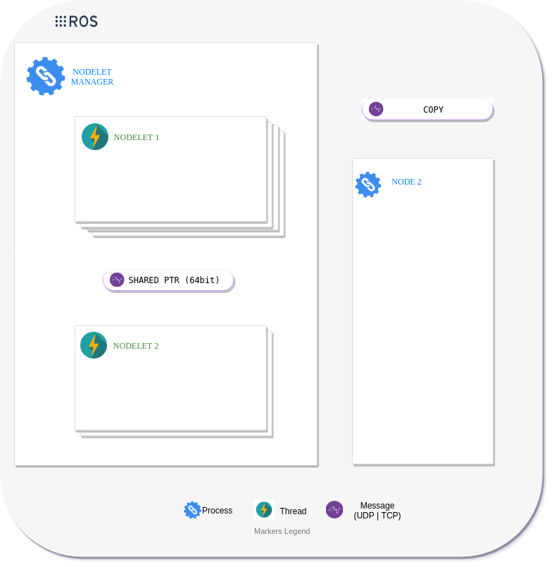

# Renault Nodelets
One of the best benefit of using ROS is the Nodelet mechanisms.
Manly for these reasons:

- Nodelet's code run inside **Threads**.
- Nodelet's communications take place through **pointers**.
    
